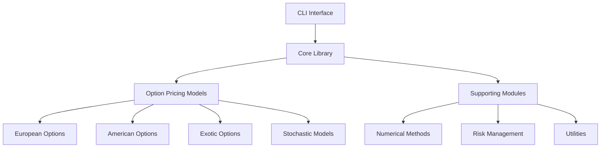

# System Design for Trillion Dollar Equation

## Overview

The Trillion Dollar Equation project is a comprehensive financial engineering library implemented in Rust that provides implementations of various option pricing models and related financial calculations. The system is designed with modularity, performance, and accuracy as core principles.

## Architecture

### High-Level Architecture



### Core Components

#### 1. Option Pricing Models
- **European Options**: Black-Scholes model and variants
- **American Options**: Binomial tree model
- **Exotic Options**: Asian, Barrier, Lookback options
- **Stochastic Models**: Jump diffusion, stochastic volatility models

#### 2. Supporting Modules
- **Numerical Methods**: Solvers, Monte Carlo simulation, interpolation
- **Risk Management**: Greeks calculation, Value at Risk
- **Utilities**: Configuration management, data validation, error handling

## Module Structure

```
src/
├── lib.rs                 # Library entry point
├── main.rs                # CLI application
├── cli/                   # Command-line interface
│   └── mod.rs
├── models/                # Core pricing models
│   ├── black_scholes.rs   # European option models
│   ├── binomial_model.rs  # Binomial tree model
│   ├── monte_carlo.rs     # Monte Carlo simulation
│   ├── implied_volatility.rs  # Implied volatility solvers
│   └── mod.rs
└── utils/                 # Utility functions
    └── mod.rs
```

## Data Flow

### 1. Input Processing
1. User provides option parameters (underlying price, strike, time to expiry, etc.)
2. Input validation ensures all parameters are within acceptable ranges
3. Parameters are encapsulated in appropriate data structures

### 2. Model Selection
1. Based on option type, the appropriate pricing model is selected
2. Model-specific configurations are applied
3. Numerical methods are initialized if required

### 3. Calculation Execution
1. Mathematical formulas are applied to calculate option prices
2. Greeks and other risk metrics are computed
3. Results are validated for accuracy and reasonableness

### 4. Output Generation
1. Results are formatted for display or further processing
2. Error conditions are handled gracefully
3. Performance metrics are collected if applicable

## Key Design Principles

### 1. Type Safety
- Strong typing ensures parameter correctness at compile time
- Custom error types provide meaningful error messages
- Option types handle potential absence of values

### 2. Performance
- Zero-cost abstractions where possible
- Efficient algorithms for numerical computations
- Parallel processing for Monte Carlo simulations

### 3. Modularity
- Each model is implemented as a separate module
- Clear interfaces between components
- Minimal coupling between modules

### 4. Testability
- Pure functions where possible for easy testing
- Comprehensive test coverage for all models
- Integration tests verify end-to-end functionality

## Implementation Details

### European Options Module
- Implements Black-Scholes formula for standard European options
- Supports various extensions (dividends, futures, FX options)
- Provides Greeks calculation for risk management

### Binomial Model Module
- Implements binomial tree method for American options
- Supports configurable number of steps for accuracy control
- Handles dividend-paying underlying assets

### Monte Carlo Module
- Implements Geometric Brownian Motion paths
- Supports variance reduction techniques
- Handles path-dependent options (Asian, Barrier)
- Configurable number of simulations and time steps

### Implied Volatility Module
- Implements Newton-Raphson and bisection methods
- Provides robust convergence handling
- Supports both call and put options

## Error Handling

### Error Types
1. **InvalidInput**: Parameters outside valid ranges
2. **NumericalError**: Convergence failures or mathematical errors
3. **InsufficientSimulations**: Monte Carlo paths too few for accuracy
4. **ConfigurationError**: Invalid model configurations

### Error Propagation
- Errors are propagated using Rust's Result type
- Context is preserved through error chains
- User-friendly error messages are provided

## Testing Strategy

### Unit Tests
- Each mathematical formula is tested against known values
- Edge cases are validated (at-the-money, deep in/out of money)
- Boundary conditions are checked

### Integration Tests
- End-to-end workflows are verified
- Cross-model consistency is validated
- Performance benchmarks are established

### Property-Based Tests
- Mathematical properties are verified (put-call parity, etc.)
- Convergence properties are tested
- Greeks are validated against finite difference approximations

## Performance Considerations

### Computational Efficiency
- Mathematical functions are optimized
- Memory allocations are minimized
- Parallel processing is used for Monte Carlo simulations

### Numerical Stability
- Careful handling of floating-point operations
- Appropriate use of logarithms to avoid overflow
- Stable algorithms for numerical methods

## Extensibility

### Adding New Models
1. Create a new module in the models directory
2. Implement the pricing logic with appropriate data structures
3. Add comprehensive tests
4. Integrate with CLI for demonstration

### Configuration Management
- External configuration files for model parameters
- Environment-specific settings
- Runtime parameter adjustment

## Security Considerations

### Input Validation
- All user inputs are validated before processing
- Range checks prevent mathematical errors
- Type safety prevents injection attacks

### Resource Management
- Memory usage is bounded
- Simulation parameters have reasonable limits
- Thread pools are properly managed

## Deployment

### Build Process
- Cargo is used for dependency management and building
- Release profiles optimize for performance
- Documentation is generated from source code

### Distribution
- Executable binaries for major platforms
- Library crates for integration with other projects
- Docker images for containerized deployment

## Monitoring and Maintenance

### Logging
- Structured logging for debugging and monitoring
- Performance metrics collection
- Error reporting with context

### Updates
- Semantic versioning for releases
- Backward compatibility maintained
- Deprecation warnings for obsolete features

## Future Enhancements

### Short-term Goals
1. Web API interface for remote access
2. Database integration for historical data
3. Advanced visualization tools

### Long-term Vision
1. Machine learning integration for parameter optimization
2. Quantum computing preparation for complex calculations
3. Real-time market data integration